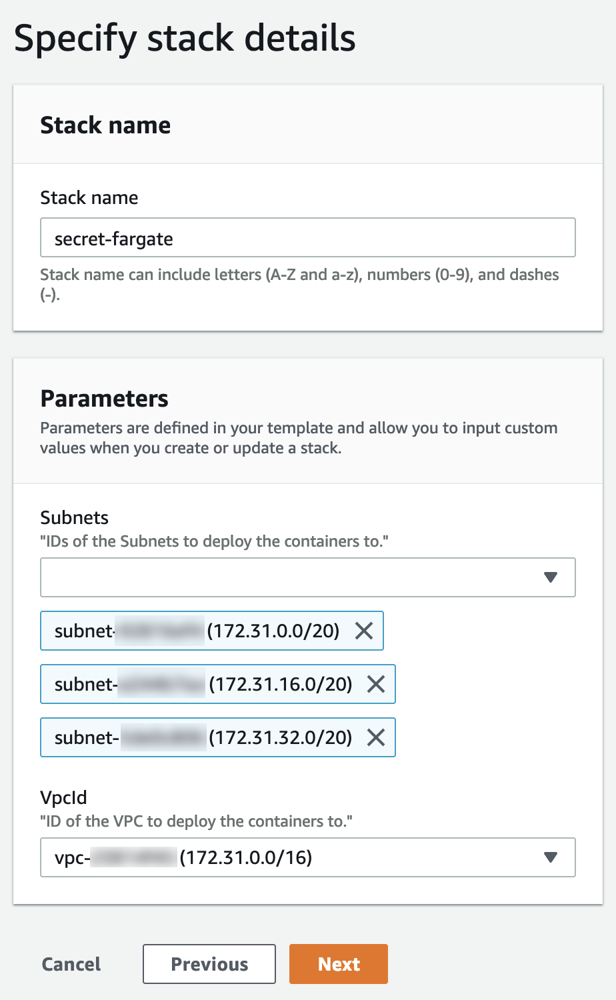

# Secrets in Fargate

There are multiple ways to use ‘secrets’ in ECS and ECS Fargate. Most of the time they are exposed using Environment variables, because a few years ago this was the only easy option. Today we have two options. You could add a tool to your docker container which retrieves and decrypts your secrets, or embed the retrieval and decryption in your application. Both approaches are covered in this blog post. This is what we are going to do:

1. Put a secret in the SSM Parameter Store
2. Add the ssm-env tool to your Dockerfile to replace secrets at ‘boot time’
3. Add some logic to your application to retrieve secrets
4. Add a reference to the secret in container environment variables using CloudFormation

## 1. Put a secret in the SSM Parameter Store

This time we add the secret manually, for example in case of a third party api key shared with you. You could also generate a secret using the [CloudFormation extension](https://github.com/binxio/cfn-secret-provider), for example when you want to generate a secret which nobody should know, even you. (Do not forget to restrict access to the SSM Parameter Store.)

```
aws ssm put-parameter \
  --name my.little.secret \
  --type SecureString \
  --value "th15-1s-53cur3"
```

## 2. Add the ssm-env tool to your app

Now add the following code to your Dockerfile. It will download and validate the `ssm-env` [tool](https://github.com/remind101/ssm-env) written in golang. To access the AWS APIs like SSM, you need to install certificates. Check out the complete dockerfile [here](https://github.com/binxio/aws-ssm-fargate-secrets-blog).

```docker
FROM alpine
# SSM Secret Sauce
RUN wget -O /usr/local/bin/ssm-env https://github.com/remind101/ssm-env/releases/download/v0.0.3/ssm-env
RUN echo “c944fc169d860a1079e90b03a8ea2c71f749e1265e3c5b66f57b2dc6e0ef84f8  /usr/local/bin/ssm-env” | sha256sum -c -
RUN chmod +x /usr/local/bin/ssm-env
RUN apk add —no-cache ca-certificates
ENTRYPOINT [“/usr/local/bin/ssm-env”, “-with-decryption”]
# /SSM Secret Sauce
```

It will iterate all environment variables and search for the `ssm://` prefix. When found, it will use the IAM role of the container to retrieve the secret and replaces the value for the secret. For example:

```
MY_LITTLE_SECRET=ssm://my.secret
# becomes within the container
MY_LITTLE_SECRET=th15-1s-53cur3
```

## 3. Add some logic to your application to retrieve secrets
In this example the public Docker image: _mvandongen/alittlesecret_ is used, which is just a very simple Python Flask application. The first section will retrieve the SSM secret using the SDK. The secret in the second part is already decrypted. This is probably used for (legacy) applications or applications that you cannot easily change.

```python
from flask import Flask
import boto3
import os

app = Flask(__name__)

def ssm_secret(path, prefix = "ssm_sdk://"):
    client = boto3.client('ssm') # uses the container role
    prefix_len = len(prefix)
    if os.environ['SECRET_SDK'][0:prefix_len] == prefix:
        result = client.get_parameter(
            Name=os.environ['SECRET_SDK'][prefix_len:],
            WithDecryption=True
        )
        secret = result['Parameter']['Value']
    else: 
        secret = os.environ['SECRET_SDK']
    return secret

@app.route("/")
def hello():
    # section 1: get the secret and decrypt it using the sdk
    secret = ssm_secret(
        os.environ['SECRET_SDK'],
        os.environ['SECRET_SDK_PREFIX']
    )
    section1 = "SDK decrypted: " + secret
    # section 2: get the already decrypted secret
    section2 = "ssn-env decrypted: " + os.environ['SECRET']
    return section1 + section2

app.run(host='0.0.0.0', port=80)
```

## 4. Add a reference to the secret in container environment variables using CloudFormation
Let’s deploy this Fargate container using CloudFormation. It works well in any public VPC, also the default VPC. 

```yaml 
AWSTemplateFormatVersion: "2010-09-09"
Description: >
  "AWS Example Setup For Secrets in ECS / ECS Fargate"

Parameters:

  VpcId:
    Type: AWS::EC2::VPC::Id
    Description: >
      "ID of the VPC to deploy the containers to."

  Subnets:
    Type: List<AWS::EC2::Subnet::Id>
    Description: >
      "IDs of the Subnets to deploy the containers to."

Resources:

  Cluster:
    Type: AWS::ECS::Cluster
    Properties: {}

  Service:
    Type: AWS::ECS::Service
    Properties:
      Cluster: !Ref Cluster
      TaskDefinition: !Ref 'TaskDefinition'
      DesiredCount: 1
      LaunchType: 'FARGATE'
      NetworkConfiguration:
        AwsvpcConfiguration:
          Subnets: !Ref 'Subnets'
          SecurityGroups:
            - !Ref SecurityGroup
          AssignPublicIp: 'ENABLED'

  TaskDefinition:
    Type: AWS::ECS::TaskDefinition
    Properties:
      NetworkMode: 'awsvpc'
      Cpu: '256'
      Memory: '512'
      ExecutionRoleArn: !Ref TaskRole
      TaskRoleArn: !Ref TaskRole
      RequiresCompatibilities:
        - FARGATE
      ContainerDefinitions:
        -
          Name: "asecretservice"
          Image: "mvandongen/asecretservice:latest"
          PortMappings:
            - ContainerPort: 80
          Environment:
            - Name: "SECRET"
              Value: "ssm://my.little.secret"
            - Name: "SECRET_SDK"
              Value: "ssm_sdk://my.little.secret"
            - Name: "SECRET_SDK_PREFIX"
              Value: "ssm_sdk://"
          LogConfiguration:
            LogDriver: awslogs
            Options:
              awslogs-region: !Ref AWS::Region
              awslogs-group: !Ref LogGroup
              awslogs-stream-prefix: ecs

  TaskRole:
    Type: AWS::IAM::Role
    Properties:
      AssumeRolePolicyDocument:
        Statement:
          - Effect: Allow
            Principal:
              Service:
                - ecs-tasks.amazonaws.com
            Action:
              - sts:AssumeRole
      Path: /
      ManagedPolicyArns:
        - 'arn:aws:iam::aws:policy/AmazonSSMReadOnlyAccess'
        - 'arn:aws:iam::aws:policy/service-role/AmazonECSTaskExecutionRolePolicy'

  SecurityGroup:
    Type: AWS::EC2::SecurityGroup
    Properties:
      VpcId: !Ref 'VpcId'
      GroupDescription: "Public access to container"
      SecurityGroupIngress:
        - FromPort: 80
          ToPort: 80
          IpProtocol: 'tcp'
          CidrIp: "0.0.0.0/0"

  LogGroup:
    Type: AWS::Logs::LogGroup
    Properties:
      LogGroupName: !Sub "${AWS::StackName}"
```

Because of the few parameters which are easy to select, we deploy the stack using the console. You could also use the cli if you want.



Now find the public IP address of the Docker container running in Fargate, and use curl or a web browser to check out the decrypted secrets. Also try to find the secrets in the AWS Management Console. It is not visible in the CloudFormation console, not in the ECS Fargate console. It’s only visible in the SSM Parameter Store.

## Conclusion

In this blog post we have created a secret in the AWS SSM parameter store and retrieved it in a Docker container, without exposing it anywhere in the Management Console. By using the SDK, the programmer makes sure the secret is only retrieved and used where needed, this is most secure. 

In the second example, from the application perspective, it’s just an environment variable within the container. When you leak all env vars, you also leak your secret, making this less secure.

It now becomes really easy to rotate secrets. It even doesn’t require a deployment.

1) update the secret in the SSM parameter store
2) gracefully terminate containers (assuming auto healing is enabled)
